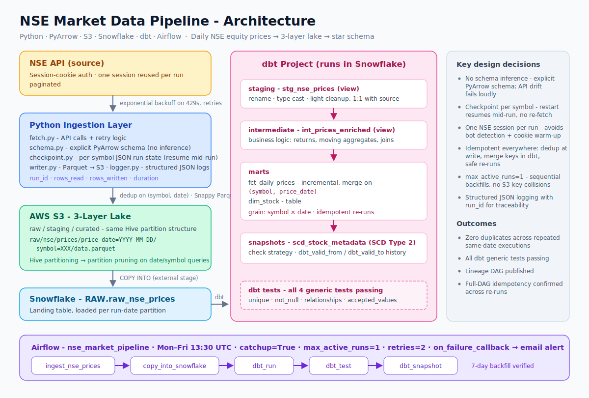

# nse-market-pipeline

Daily ingest of NSE equity prices into a 3-layer S3 -> Snowflake -> dbt warehouse. Orchestrated in Airflow.

---

## Architecture



```
NSE API (unofficial, session-cookie based)
  |  fetch with exponential backoff on 429s, one session reused across symbols
S3 raw   raw/nse/prices/price_date=YYYY-MM-DD/symbol=XXX/data.parquet
  |  explicit PyArrow schema, dedup on (symbol, date), Snappy compressed
S3 staging / curated  (same Hive partition structure)
  |  COPY INTO
Snowflake RAW.raw_nse_prices
  |  dbt: stg_ -> int_ -> fct_/dim_ + snapshot
Snowflake MARTS.fct_daily_prices   (incremental merge, grain: symbol �- date)
Snowflake MARTS.dim_stock
Snowflake SNAPSHOTS.scd_stock_metadata  (SCD Type 2)
```

Airflow DAG runs Mon-Fri at 13:30 UTC. `catchup=True`, `max_active_runs=1` so backfills run sequentially without S3 key collisions.

---

## dbt models

| Layer | Model | Type |
|-------|-------|------|
| staging | stg_nse_prices | view |
| intermediate | int_prices_enriched | view |
| marts | fct_daily_prices | incremental (merge on symbol, price_date) |
| marts | dim_stock | table |
| snapshots | scd_stock_metadata | SCD2 (check strategy) |

---

## Setup

Requires Python 3.9+, Docker, AWS account with S3 access, Snowflake account.

```bash
git clone https://github.com/sachin-ram/nse-market-pipeline.git
cd nse-market-pipeline
python -m venv env && source env/bin/activate
pip install -r requirements.txt
cp .env.example .env   # fill in credentials

docker-compose up -d   # starts Airflow (localhost:8080)

cd dbt_project && dbt deps && dbt debug
```

---

## Running manually

```bash
# today's data
python -m ingestion.main

# specific date, dry run
python -m ingestion.main --run-date 2024-01-15 --dry-run

# different index
python -m ingestion.main --run-date 2024-01-15 --index "NIFTY BANK"
```

```bash
cd dbt_project
dbt run
dbt snapshot
dbt test
```

---

## Tests

```bash
pytest tests/ -v
```

---

## Design notes

- **No schema inference**: PyArrow schema is explicit. API shape changes fail loudly.
- **Checkpoint per symbol**: A JSON checkpoint file tracks which symbols completed. Restarts pick up mid-run without re-fetching.
- **Session reuse**: One NSE session is created per pipeline run, not per symbol. Reduces cookie warm-up overhead and avoids triggering bot detection.
- **Idempotent incremental**: dbt merge on `(symbol, price_date)` - re-running on the same date is safe.

---

## Folder structure

```
nse-market-pipeline/
|-- ingestion/
|   |-- config.py       dataclass config from env vars
|   |-- schema.py       PyArrow schema + field mapping from NSE API keys
|   |-- checkpoint.py   symbol-level run state
|   |-- fetch.py        NSE API calls, retry logic
|   |-- writer.py       Parquet -> S3, Snowflake COPY INTO
|   |-- logger.py       structured JSON logging
|   `-- main.py         CLI entrypoint
|-- dbt_project/
|   |-- models/staging/
|   |-- models/intermediate/
|   |-- models/marts/
|   |-- snapshots/
|   `-- macros/
|-- airflow/dags/
|-- tests/
|-- sample_data/
`-- docker-compose.yml
```
