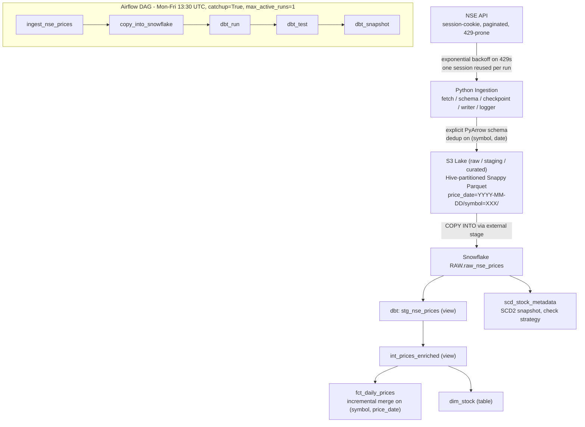

# NSE Market Data Pipeline
> **Diagram:** see `architecture.svg` in this folder (opens in any browser).

---

## 30-second pitch

"I built an end-to-end daily market data pipeline that ingests NSE equity closing prices through a paginated, session-cookie-based API into a 3-layer S3 data lake (raw/staging/curated) as Hive-partitioned Parquet, loads it into Snowflake via COPY INTO, and models it with a full dbt project - staging -> intermediate -> fact/dim layers plus an SCD Type 2 snapshot. The whole thing is orchestrated in Airflow with verified 7-day backfill and confirmed idempotency: re-running any day produces zero duplicates."

---

## Architecture walkthrough (2-3 min)

**Flow in words:**

1. **Ingest (Python):** `fetch.py` hits the NSE API with one reused session per run (avoids bot detection and cookie warm-up). Retries use exponential backoff on HTTP 429. `checkpoint.py` keeps per-symbol JSON state so a crashed run resumes mid-run without re-fetching completed symbols.
2. **Schema enforcement:** `schema.py` defines an explicit PyArrow schema - no inference. If the API shape changes, the pipeline fails loudly instead of silently writing bad types.
3. **Lake:** Parquet written to S3 in 3 layers (raw/staging/curated), Hive-partitioned by `price_date` and `symbol`, Snappy-compressed, with dedup on `(symbol, date)` before write.
4. **Warehouse:** `COPY INTO` loads the curated layer into `RAW.raw_nse_prices` in Snowflake.
5. **dbt:** `stg_` (rename/cast, view) -> `int_prices_enriched` (business logic, view) -> `fct_daily_prices` (incremental, merge on `(symbol, price_date)`, grain symbol �- date) and `dim_stock`. `scd_stock_metadata` is an SCD2 snapshot with `dbt_valid_from/to`.
6. **Orchestration:** Airflow DAG `ingest -> copy_into_snowflake -> dbt_run -> dbt_test -> dbt_snapshot`, Mon-Fri 13:30 UTC (30 min after NSE close at 15:30 IST), 2 retries, `on_failure_callback` sends an email alert. Every task reads `{{ ds }}` so backfills are date-correct.

---

## Key design decisions (and the "why")

**Why explicit PyArrow schema instead of inference?**
Inference makes type decisions per file - a column that's all nulls one day becomes a different type the next, and downstream merges break silently. Explicit schema turns API drift into an immediate, loud failure at the ingestion boundary, which is the cheapest place to catch it.

**Why 3 S3 layers?**
Raw is an immutable audit copy of what the API returned - I can reprocess history if transformation logic changes without re-hitting the API. Staging holds cleaned/deduped data; curated is query-ready. Separation of concerns: bugs in transformation never corrupt the source of truth.

**Why Hive partitioning (`price_date=.../symbol=...`)?**
Both Snowflake's COPY INTO and any engine reading S3 (Athena, Spark) can prune partitions - a single day's load touches only that day's keys. It also makes idempotent overwrites trivial: a re-run for a date rewrites exactly one partition.

**Why merge-based incremental in dbt instead of append?**
Re-runs and backfills are facts of life. Merge on `(symbol, price_date)` means re-running a date updates rather than duplicates. I verified zero duplicates across repeated same-date executions.

**Why `catchup=True` with `max_active_runs=1`?**
I want historical backfill, but parallel backfill runs could write to overlapping S3 prefixes. Capping at 1 active run makes backfills strictly sequential - slower, but collision-free and predictable.

**Why checkpoint per symbol?**
The API is flaky (429s, session expiry). With ~50+ symbols per run, a failure at symbol 40 shouldn't redo 39 successful fetches. The JSON checkpoint records completed symbols; restart skips them.

---

## Questions interviewers ask, with answers

**"How do you guarantee idempotency end-to-end?"**
Three layers: (1) ingestion dedups on `(symbol, date)` and writes to a deterministic partition path, so re-runs overwrite, not append; (2) COPY INTO loads per run-date partition; (3) the dbt fact model merges on the natural key. I tested it by running the full DAG twice for the same date and confirming row counts and a zero-duplicate check.

**"What happens when the API rate-limits you?"**
Exponential backoff with jitter on 429s. Also preventive: one session reused across all symbols per run reduces request overhead and avoids the bot-detection patterns that trigger 429s in the first place.

**"How do you handle late or corrected data?"**
Re-run the DAG for that logical date. Because every layer is idempotent, the corrected data flows through and the merge updates existing fact rows in place.

**"What does the SCD2 snapshot track and why?"**
Stock metadata (e.g., name, sector, index membership) changes over time. The dbt snapshot (check strategy) preserves history with `dbt_valid_from/to`, so point-in-time joins are possible - "what sector was this stock in on date X?"

**"How would you scale this 100x?"**
Swap the single-process Python loop for PySpark on the ingest/transform side (the lake layout already suits Spark); move checkpointing from a JSON file to DynamoDB or a Postgres table for concurrent workers; use Snowpipe for continuous loading instead of batch COPY INTO; and partition the Airflow DAG per symbol-group with dynamic task mapping.

**"How do you monitor it?"**
Structured JSON logs with `run_id`, `rows_read`, `rows_written`, `duration` per run - greppable and ready for log aggregation. Airflow `on_failure_callback` emails on any task failure. `dbt test` runs inside the DAG, so data quality failures block the snapshot step.

---

## Numbers to remember

- 3 S3 layers, Hive-partitioned by date + symbol
- Fact grain: symbol �- date, incremental merge
- All 4 dbt generic tests passing (unique, not_null, relationships, accepted_values)
- 7-day backfill verified; zero duplicates on re-run
- DAG: 5 tasks, Mon-Fri 13:30 UTC, retries=2, sequential backfill
